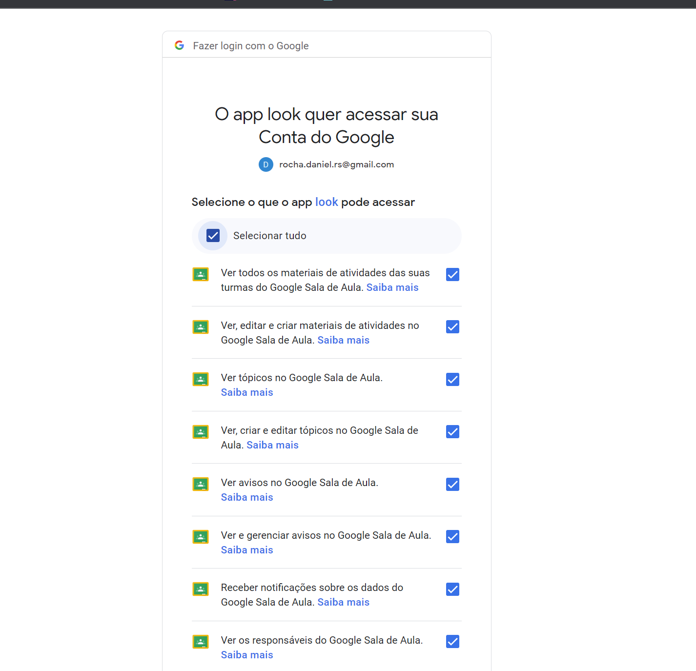

## Table of Contents

- [Code Style](#code-style)
- [Your First Code Contribution](#your-first-code-contribution)
  - [obs](#obs)
  - [Indention](#indention)
  - [Commit message](#commit-message)
- [Setup](#setup)


## Code Style:
 - Seguir code style google: [Google Styleguide](google.github.io/styleguide/javaguide.md)

## Your First Code Contribution
### Obs
Adicionar abstracação no package core e implementação especifica no pacote infra. Caso exista somente 
uma implementação para a interface especifica que possua o mesmo nome da interface adicione o sufixo ```Impl```. Exemplo: 
```TeacherService.java``` no *core* e  ```TeacherServiceImpl.java``` em *infra*. 

### Indention
- 4 espaços

### Commit message
- [Conventional Commits](https://www.conventionalcommits.org/en/v1.0.0/)

## Setup
### Configuração do cliente do classroom
Definir variaveis de ambiente ```LOOK_GCLOUD_SERVER_CLIENT_ID``` e ```LOOK_GCLOUD_SERVER_CLIENT_SECRET``` ou definir valores em application.yaml

```yaml
look:
  cloud:
    gcp:
      server:
        # IDs do cliente Classroom - Desktop
        client:
          id: ${LOOK_GCLOUD_SERVER_CLIENT_ID:<default-client-id>}
          secret: ${LOOK_GCLOUD_SERVER_CLIENT_SECRET:<default-secret>}
```

Valores abaixo são exemplos e não funcionam.
- exemplos para cliente id: ```000000000000-b5qg23t7n1s50h2aspaec6l4ucavkjqn.apps.googleusercontent.com```
- exemplos para secret: ```AOCSCX-001ASj1jkBNZgPEa-yQ7SxWUiILA```

### Configuração do cliente OAuth2
Definir variaveis de ambiente ```LOOK_GCLOUD_CLIENT_ID``` e ```LOOK_GCLOUD_CLIENT_SECRET``` ou definir valores em application.yaml
```yaml

spring:
  security:
    oauth2:
      client:
        registration:
          google:
            # IDs do cliente OAuth 2.0 - auth-look - Web
            client-id: ${LOOK_GCLOUD_CLIENT_ID:<default-client-id>}
            client-secret: ${LOOK_GCLOUD_CLIENT_SECRET:<default-secret>}
```

Valores abaixo são exemplos e não funcionam.
- exemplos para cliente id: ```000000000000-b5qg23t7n1s50h2aspaec6l4ucavkjqn.apps.googleusercontent.com```
- exemplos para secret: ```AOCSCX-001ASj1jkBNZgPEa-yQ7SxWUiILA```


#### OBS
Os valores de ***cliente ID*** e ***secret*** são obtidos no Google Cloud Platform (GCP)

### Run

````shell
./mvnw spring-boot:run
````

#### Autorizando teacher bot
- Copie e cole o link que foi exibido no terminal no navegador de internet:


- Selecione a conta google para lidar com a integração com o classroom. Obs: A conta deve está como um professor.


#### Acesso aos recursos:
- Acesse [localhost:8085](localhost:8085) e acesse com uma conta de um estudante para testar a API.